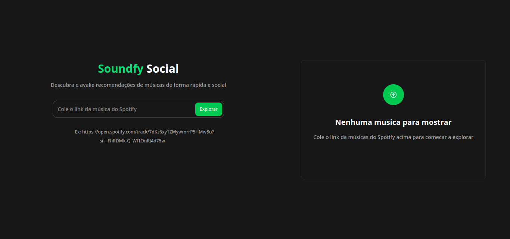
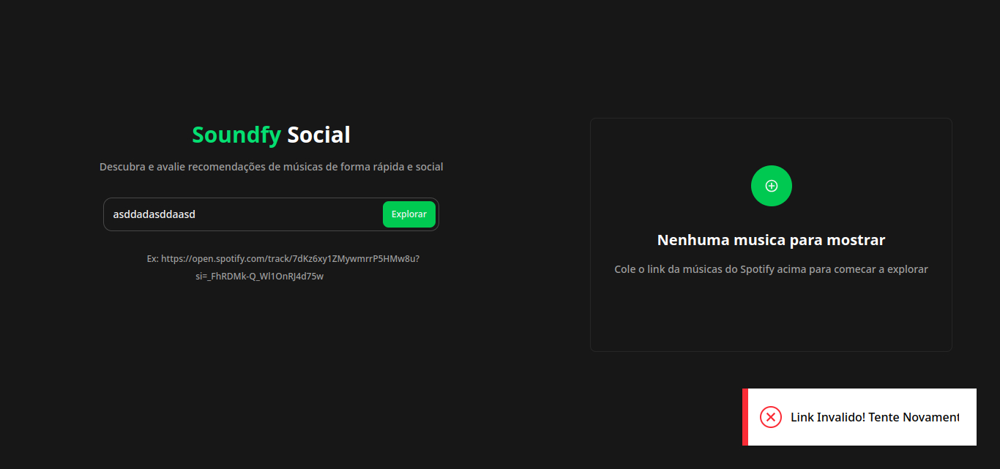
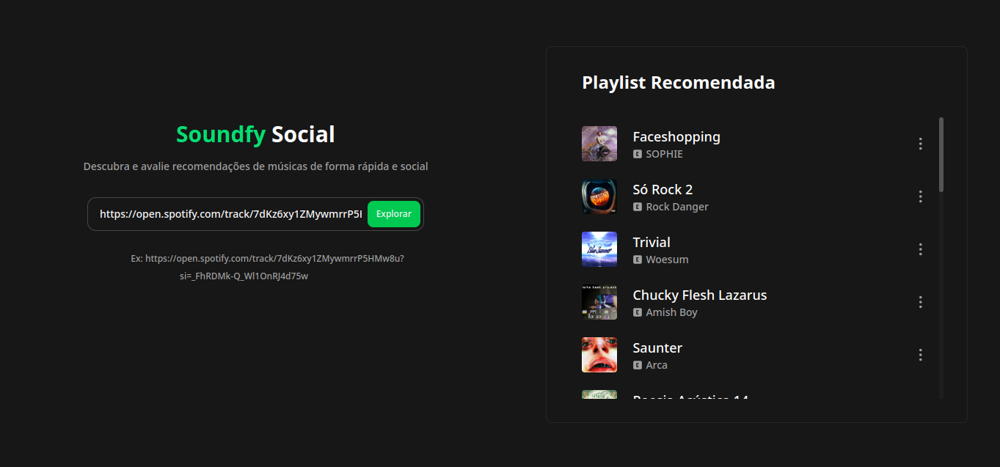
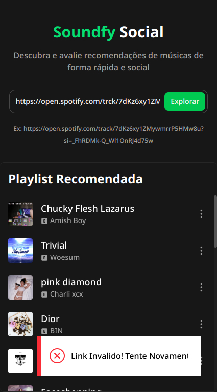

  

# Soundfy | Descubra e avalie músicas de forma divertida e social

     <a target='_blanc' href="https://icarojordano.github.io/soundfy/">📱 Visite o Projeto</a>

## 📝 Descrição do Projeto
Soundfy é uma plataforma de recomendação musical simplificada, desenvolvida para contornar as limitações do endpoint público de recomendações do Spotify, sem exigir autenticação OAuth. O projeto utiliza a API pública do Spotify e um algoritmo próprio de recomendação para oferecer sugestões musicais de forma rápida e acessível.

Com o Soundfy, o usuário pode:

- *Inserir um link de compartilhamento de qualquer música do Spotify
- *Receber uma lista personalizada de faixas relacionadas
- *Visualizar informações como capa, artista e nome da música
- *Acessar as faixas sugeridas diretamente pelo Spotify

O foco principal está em simplificar o acesso às recomendações musicais, sem necessidade de login, token de usuário ou configurações avançadas — ideal para entusiastas de música, criadores de conteúdo e curiosos musicais.

Esta é uma versão MVP (Produto Mínimo Viável), funcional nos principais fluxos e pronta para testes de usabilidade e expansão futura.

Perfeito como base para sistemas de curadoria musical, playlists inteligentes ou explorações com APIs públicas em projetos frontend.

## 💻 Tech Stack

<!--- # "Verify icons availability here https://github.com/tandpfun/skill-icons" -->

 

<h2 id="layout">🎨 Layout</h2>

    
    
    
    

    
    
    
    

## 🧩 Features
 - [X] Inserção de link de música via compartilhamento do Spotify
 - [X] Extração automática dos dados da faixa (nome, artista, imagem)
 - [X] Algoritmo próprio de recomendação com base na música inserida
 - [X] Sugestões de faixas semelhantes sem necessidade de login OAuth
 - [X] Cards interativos com título, artista e capa da música recomendada
 - [X] Botões com link direto para ouvir a música no Spotify
 - [X] Design limpo, moderno e responsivo (mobile-first)
 - [X] Projeto leve e funcional, ideal para estudos com APIs públicas
 - [X] Feedback visual para links inválidos ou falhas de resposta
 - [X] Experiência fluida sem necessidade de recarregar a página

<h2 id="colab">🤝 Collaborators</h2>

Agradecimento especial a todas as pessoas que contribuíram para este projeto.

<table>
  <tr>
    <td align="center">
      <a href="https://www.linkedin.com/in/icaro-jordano/" target="_blanc">
         
        
          <b>Icaro Jordano | Desenvolvedor 
            e Tech Manager</b>
        
      </a>
    </td>
    <td align="center">
    <a href="https://www.linkedin.com/in/icaro-jordano/" target="_blanc">
         
        
          <b>Api Spotify Web for Developers</b>
        
      </a>
    </td>
  </tr>
</table>
